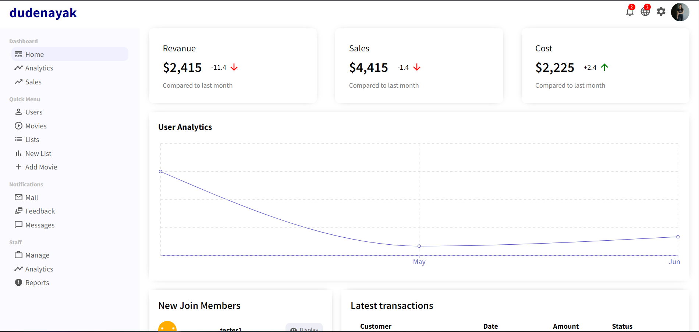

## Netflix Clone 💻

* A fully functional web application that allows high quality streaming for **multiple** users.
* Demonstration of the Web App : 

#### Built a Netflix Clone
A streaming service that offers a wide variety of award-winning TV shows, movies, anime, documentaries and more – on thousands of internet-connected devices. It contains a fully connected backend with admin controls over the data manipulation such as uploading new movies/series, removing existing ones if needed and maintaining a track of users.

### Features Accomplished 🤩
* Individual User Portal
* High Quality Streaming
* User Login/SignUp
* Logout
* Admin Dashboard- 
    * Upload/Remove/Update Video Content
    * Tracks User Activity
    * Add New List & Genre

### Technology Decisions 👩🏻‍💻
* **IDE** : Visual Studio Code
* **Platform** : Firebase
* **Libraries** :
	 * React.JS
	 * ReCharts
	 * Axios
* **Framework** : Express
* **Runtime Environment** : Node.JS
* **Version Control System :** GitHub
* **Database :** MongoDB
* **Languages** :
	* HTML
	* SCSS
	* CSS
	* JavaScript
### Agile Methodology 🏃
Agile is a chain of development in which specific set of tasks are performed iteration wise according to the priority. I divided the web App into smaller chunks and worked on each of them separately. Agile methodology taught me how to work flawlessly and in an organized manner.

### Download Files 👇
* Go to my GitHub repository: https://github.com/dudenayak/Netflix_Clone
* Download Zip or clone repository
* Then open the folder in your IDE 

### Install the Dependencies ✌️

```shell
# run yarn install or npm install
npm install
```

### Run the App 😻

```shell
# to start the Web App, type
npm start
```
Runs the app in the development mode.

Open [http://localhost:3000](http://localhost:3000) to view the functioning of client side in the browser 🎉

Open [http://localhost:4000](http://localhost:4000) to view the functioning of admin side in the browser 🎉

### Glimpses 📷
 **Home Page** 🎞  

 **Genre** 🥠  

 **Movie Lists** 🫠 

 **Login** 🟢🔴  

 **SignUp** ✅  

 **Admin** 🕴🻠 

 **Users** [👤](https://emojipedia.org/bust-in-silhouette/)

 **Movies** [🎥](https://emojipedia.org/movie-camera/)  

 **Add Movie** ➕  

 **Lists** 🫠 

 **New List** ➕  
